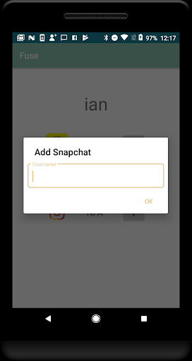
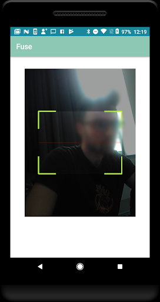
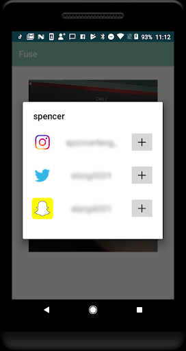

# Fuse
Social Media Profile Aggregator

This project was done in a small group as the final project for my Mobile Software Development course at [AIT Budapest](https://www.ait-budapest.com/). While the end product was a little rough on the UI side, the main goal in this project was to showcase our skills implementing numerous android technologies as well as experiment with a few others we had not learned during the course.

The idea for Fuse was to create an aggregator for social media accounts that would make it quite easy to follow/friend/add others on their social medias without the hassle of looking up their profiles on each social media platform.

| Home | Add your own media | QR Reader | Pop up with peer account info |
|------|--------------------|-----------|-------------------------------|
|||||   
   
The app contains a simple splash screen with an animated logo, which then launches into a login/sign up screen. Fuse was built with a Firebase backend which allowed users to create accounts and store their social media profiles to be easily accessible.

The Home screen (see above) contains the QR code associated with a user's account as well as navigation buttons to other pages. 
