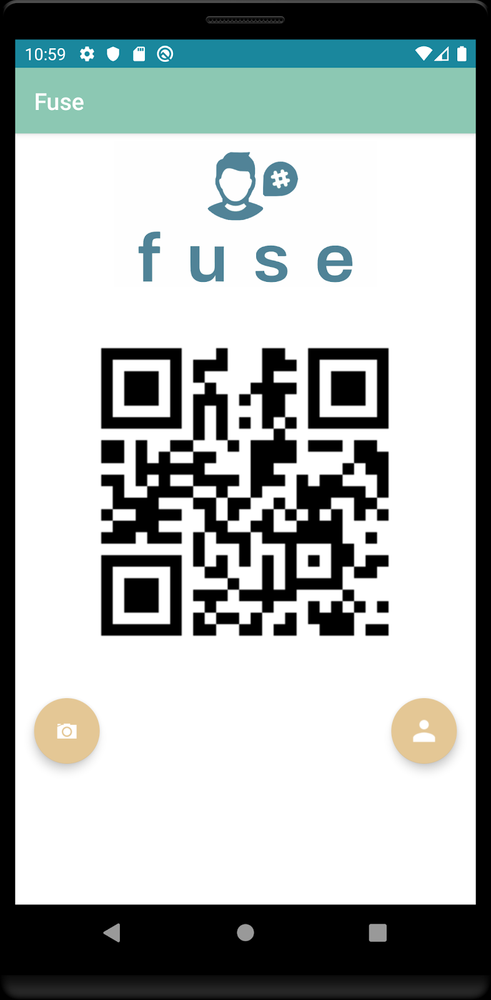

# Fuse
Social Media Profile Aggregator

This project was done in a small group as the final project for my Mobile Software Development course at AIT Budapest. While the end product was a little rough on the UI side, the main goal in this project was to showcase our skills implementing numerous android technologies as well as experiment with a few others we had not learned during the course.

The idea for Fuse was to create an aggregator for social media accounts that would make it quite easy to follow/friend/add others on their social medias without the hassle of looking up their profiles on each social media platform.

Home                       |  ??
:-------------------------:|:-------------------------:
  |  
